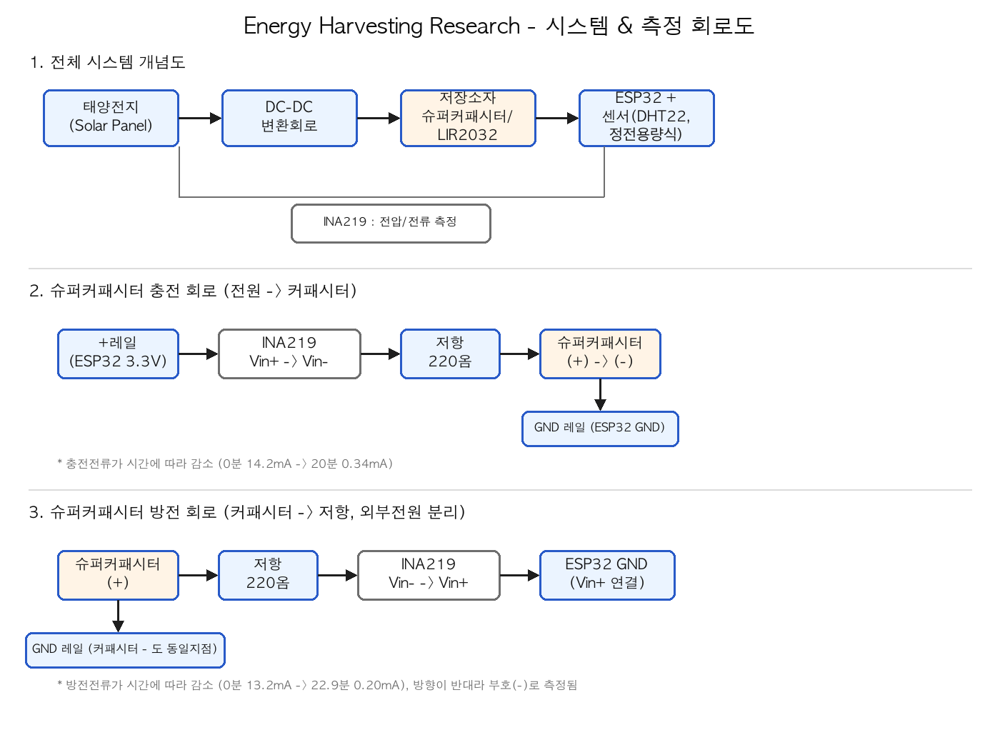

# Energy Harvesting Research Project

자연광 에너지 하베스팅 기반 슈퍼커패시터 및 충전식 배터리의 저장 특성 비교 및 저전력 환경 모니터링 시스템 적용 가능성 평가

## 개요

실내 창가 자연광을 이용한 태양광 에너지 하베스팅 시스템에서, 슈퍼커패시터와 충전식 리튬코인셀(LIR2032)의 전기적 특성(충·방전, 내부저항, 자가방전)을 비교하고, ESP32 기반 저전력 환경 모니터링 시스템에 적용했을 때의 적합성을 평가하는 연구.

## 하드웨어 구성

| 구분 | 부품 |
|---|---|
| 제어부 | ESP32 DevKitC (ESP32-WROOM-32E) |
| 발전부 | Small Solar Panel 80x100mm 1W |
| 저장부 | 슈퍼커패시터 SC5R5105ZC (5.5V/1.0F), LIR2032 (3.6V/40mAh) |
| 센서부 | DHT22(AM2302) 온습도센서, 정전식 토양수분센서 |
| 측정부 | INA219 전류/전압 센서 |
| 기타 | DC-DC 스텝업/다운 모듈, SR540 다이오드, 브레드보드 |

## 개발 환경

- Arduino IDE 2.3.10
- ESP32 board package (espressif/arduino-esp32)
- 라이브러리: Adafruit INA219, Adafruit DHT sensor library, Adafruit Unified Sensor

## 폴더 구조

```
energy-harvesting-research/
├── README.md
├── LICENSE
├── docs/                  # 회로도 등 참고 자료
├── experiment-logs/       # 실험 기록 (측정 데이터, 결과 해석)
└── arduino-code/          # 각 단계별 테스트/측정 코드
```

## 회로도

전체 시스템 개념도 + 슈퍼커패시터 충전/방전 측정 회로:



## 진행 상황

- [x] 측정 시스템 구축 (ESP32 / DHT22 / 토양수분센서 / INA219 개별 검증)
- [x] 태양전지 발전 특성 측정 (예비실험)
- [x] 슈퍼커패시터 충전 특성 측정
- [x] 슈퍼커패시터 방전 특성 측정
- [x] DHT22 소비전류 측정 (대기 vs 측정 순간)
- [x] 토양수분센서 소비전류 측정 (대기 vs 측정 순간)
- [ ] ESP32 자체 Deep Sleep vs Active 소비전력 측정
- [ ] LIR2032 충·방전 특성 측정 (충전모듈/홀더 배송 대기 중)
- [ ] 내부저항(ESR) / 자가방전 측정
- [ ] 통합 시스템 실험 및 흐린 날 장기 운용 평가

자세한 측정 데이터와 해석은 [`experiment-logs/`](./experiment-logs) 폴더 참고.

## 아두이노 코드

| 파일 | 설명 |
|---|---|
| `01_connection_test.ino` | ESP32-PC 연결 확인 (시리얼 출력) |
| `02_dht22_test.ino` | DHT22 온습도센서 테스트 |
| `03_soil_moisture_test.ino` | 정전식 토양수분센서 테스트 |
| `04_ina219_test.ino` | INA219 전압/전류 측정 (태양전지·커패시터 실험 공용) |
| `05_i2c_scanner_debug.ino` | I2C 장치 인식 문제 진단용 스캐너 |
| `06_supercap_discharge_test.ino` | 슈퍼커패시터 방전 특성 측정 (시간별 전압/전류 CSV 출력) |
| `07_dht22_power_measurement.ino` | DHT22 소비전류 측정 (대기 vs 측정 순간) |
| `08_soil_moisture_power_measurement.ino` | 토양수분센서 소비전류 측정 (대기 vs 측정 순간) |
